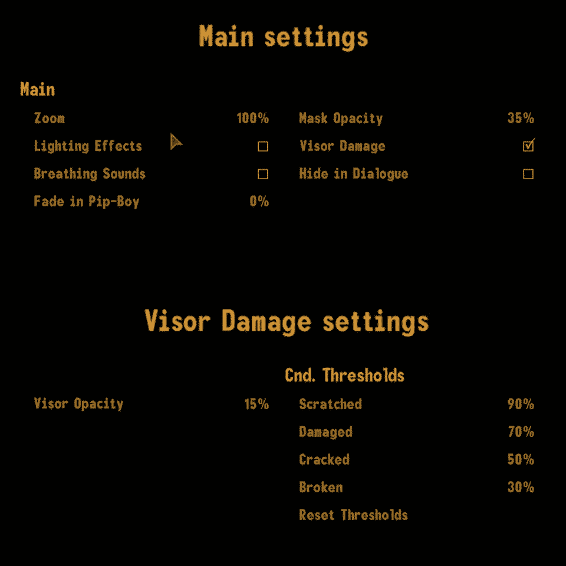

[<< Back to Readme](README.md)  
[<< Back to Setup](SETUP.md)

> PROTIP: Click on the list icon on the upper left corner of this document to see the index for this guide.

# PREAMBLE

## Disclaimer

The guide presented here assumes you have already followed all instructions found in the setup page, and are familiar with Mod Organizer 2, which we will be using to install the mods in this document. Please abstain from using this guide until you've correctly set up Fallout: New Vegas and the recommended tools.

### Creating a separator

Separators allow you to neatly separate installed mods in Mod Organizer 2 for ease of viewing. These can be created and then moved around in the left pane to place them where you want them to be.

- Right click on the empty space on the left pane, below **Overwrite**, and click **Create Separator**.
- Name your separator and click **OK**.

I suggest creating a separator for DLC as well as each mod category we will be installing. Separators can be collapsed to keep your mod list clean and tidy.

# MAXIMUM NEW VEGAS

## NVSE PLUGINS

[**Discord Rich Presence**](https://www.nexusmods.com/newvegas/mods/68976)  
Off to a great start...Integrates Discord Rich Presence into Fallout NV/TTW.

[**Crash Logger**](https://www.nexusmods.com/newvegas/mods/72317)  
A DLL that logs raw crash data.

[**JIP LN NVSE Plugin**](https://www.nexusmods.com/newvegas/mods/58277)  
Adds new functions, engine bug fixes and tweaks, and restored broken game features.

[**JohnnyGuitar NVSE**](https://www.nexusmods.com/newvegas/mods/66927)  
Adds new functions, engine bug fixes and tweaks, and restored broken game features.

[**ShowOff NVSE**](https://github.com/Demorome/Showoff-NVSE/releases)  
Adds new functions, engine bug fixes and tweaks.
- Click the **ShowOffNVSE.7z** under **Assets** to download it.
- - Click the **ShowOffNVSE_INI.7z ** under **Assets** to download it.
 
[**kNVSE Animation Plugin**](https://www.nexusmods.com/newvegas/mods/71336)  
Enables having custom animations for weapons and actors. Also fixes the engine-bound anim group limit problem.

[**OneTweak but Really Updated**](https://www.nexusmods.com/newvegas/mods/79211)  
Enables borderless window mode for safe alt-tabbing.

[**NVTF - New Vegas Tick Fix**](https://www.nexusmods.com/newvegas/mods/66537)  
Fixes the tick count bug (which creates noticable micro stutter), optimizes hash tables (helping performance and decreasing menu load times), and fixes the high FPS bug (fixing physics and lipsync at high framerates).

[**FNV Mod Limit Fix**](https://www.nexusmods.com/newvegas/mods/68714)  
Allows a maximum of 255 plugins to be loaded, as well as improving FPS, removing game stutter, and allowing for faster loading times (particularly when using a large number of mods).

[**Improved lighting Shaders**](https://www.nexusmods.com/newvegas/mods/69833)  
Almost completely fixes the exterior lighting bug, and allows up to four times the number of active lights.

[**yUI - User Ynterface**](https://www.nexusmods.com/newvegas/mods/74357)  
Aims to fix UI bugs and add new UI features. 

Files to install:
- **yUI** (Main files)
- **Matched Cursor - Fallout New Vegas** (Optional files)

[**Improved Console (NVSE**)](https://www.nexusmods.com/newvegas/mods/70801)  
xNVSE plugin that enhances the in-game console's abilities to be able to execute and print results from ALL available script commands.

[**Console Paste Support**](https://www.nexusmods.com/newvegas/mods/65906)  
Enables hotkeys for pasting and enhanced movement/deletion of console commands.

[**SUP NVSE**](https://www.nexusmods.com/newvegas/mods/73160)  
NVSE plugin which adds new functions and allows modders to easily add new UI elements to the game (HUD Bars) and read Pastebin Pastes(Pastebin Reader).


[**lStewieAl's Tweaks and Engine Fixes**](https://www.nexusmods.com/newvegas/mods/66347)  
Engine bugfixes, optional tweaks and new features with no performance impact. Fully customisable via in-game menu and INIs.

[**DXVK**](https://www.nexusmods.com/newvegas/mods/79299)  
DO NOT USE IF YOU DON'T KNOW WHAT THIS DOES EXACTLY, OR IF YOU DON'T HAVE A SOMEWHAT MODERN GPU. Even then, has some lighting issues with my current 2021 card.

## GAME PATCHES

### Bug fixes

[**Ultimate Edition ESM Fixes**](https://www.nexusmods.com/newvegas/mods/77170)  
Optimizes and cleans the esms, as well as fixes some hard errors in the landscape. Boosts performance on modern systems with SSDs. 
- Manually download **Ultimate Edition ESM Fixes** (Main files).
- Extract the contents of the archive.
- Run **Installer.exe**.
- Click **INSTALL**. **EXIT** the program once the process is finished.
- In Mod Organizer 2, press **F5** to refresh the window. Activate the **Ultimate Edition ESM Fixes** mod.

[**Yukichigai Unofficial Patch - YUP**](https://www.nexusmods.com/newvegas/mods/51664)  
Collection of bug fixes for Fallout: New Vegas and its DLCs, combined into one ESM.

Files to install:
- **YUP - Base Game and All DLC** (Main files)

[**Unofficial Patch NVSE Plus**](https://www.nexusmods.com/newvegas/mods/71239)  
Collection of bug fixes for Fallout: New Vegas and its DLCs which require NVSE.

[**yGTM**](https://www.nexusmods.com/newvegas/mods/72784)  
NVSE plugin that alters the way Global Time Multiplier is modified so to provide better compatibility between mods and base game.

[**Consistent Spread**](https://www.nexusmods.com/newvegas/mods/77974)  
Fixes non-scoped weapons inconsistent accuracy caused by vanilla weapon wobble and bugged character spread settings.

[**MoonlightNVSE**](https://www.nexusmods.com/newvegas/mods/77683)  
Fixes moonlight, making the moon the light caster instead of the sun. 

[**Combat Lag Fix**](https://www.nexusmods.com/newvegas/mods/71973)  
Improves framerate in combat by fixing an engine bug that lowered framerate while attacking an enemy with a health-bar visible.

[**Pip-Boy Shading Fix NVSE**](https://www.nexusmods.com/newvegas/mods/77957)  
Fixes Pip-Boy's shading, making it not ignore lights around it.

[**Critical and Effects - Fixes and Tweaks**](https://www.nexusmods.com/newvegas/mods/69200)  
Fixes the damage dealing critical effects of most vanilla weapons so that they cannot cause you to miss "killcounts" and other proc effects such as crime responsibility. Includes other gameplay tweaks.

[**Mostly Unarmed Tweaks**](https://www.nexusmods.com/newvegas/mods/69283)  
Fixes the fatigue-dealing weapons to deal correct and damage-adjusted fatigue. Includes other gameplay tweaks.

[**Universal Pyromaniac Buff for Fire Effects**](https://www.nexusmods.com/newvegas/mods/71505)  
Makes the Pyromaniac perk affect all the lingering fire damage effects from weapons and ammo.

[**Crippled Limb Reaction Enforcer**](https://www.nexusmods.com/newvegas/mods/73147)  
Makes the idle animations for crippled limbs come through in situations where the game cannot pick them correctly like when the damage comes from an explosion. Also makes NPCs get some more debuffs from crippling like the player does.

### Mesh fixes and optimization

[**Aqua Performa**](https://www.nexusmods.com/newvegas/mods/78617)  
Drastically improves performance on The Strip by getting rid of... water LOD.

[**New Vegas Mesh Improvement Mod**](https://www.nexusmods.com/newvegas/mods/74295)  
Optimizations and fixes for a large selection of meshes in the base game and DLC.

[**Weapon Mesh Improvement Mod**](https://www.nexusmods.com/newvegas/mods/65052)  
Fixes mesh errors, UV errors, incorrect flags, missing extra data, form lists, projectiles, and other weapon related bugs and errors.

[**Collision Meshes**](https://www.nexusmods.com/newvegas/mods/59149)  
A mod that improves collision meshes.

Files to install:
- **Collision Meshes FNV** (Main files)
- **update Collision Meshes FNV 1.6.3 to 1.6.4** (Optional files)

[**Enhanced Landscapes**](https://www.nexusmods.com/newvegas/mods/69406)  
Fixes several hundred vanilla floating objects, underground or above ground.

Files to install:

- **Enhanced Landscapes for NVLO** (Optional files)

[**Navmesh Fixes and Improvements**](https://www.nexusmods.com/newvegas/mods/62041)  
Fixes virtually every navmesh where the edge connections were missing or pointing at misplaced or invalid triangles, all while retaining the original triangle ordering at the cell edges whenever possible for maximum compatibility. Also makes improvements to the majority of the affected navmeshes, like adding gaps for obstacles such as rocks and trees.

Files to install:
- **Navmesh Fixes and Improvements - Base Game and ALL DLC** (Main files)

[**Less Flickery City of New Vegas**](https://www.nexusmods.com/newvegas/mods/72061)  
Fixes the intense flickering in the city of New Vegas (such as when looking from Goodsprings Cemetery) due to extra white proxy meshes clipping into the object LOD meshes.

[**No More Muzzle Flash Lights**](https://www.nexusmods.com/newvegas/mods/73742)  
Remove muzzle flash lights to boost performances. 

## USER INTERFACE

[**UIO - User Interface Organizer**](https://www.nexusmods.com/newvegas/mods/57174)  
An NVSE-powered plugin designed to manage and maintain all UI/HUD extensions added to the game by various mods.

[**The Mod Configuration Menu**](https://www.nexusmods.com/newvegas/mods/42507)  
Allows any number of mods to be configured from a single menu, accessible through the Pause menu.

Files to install:
- **The Mod Configuration Menu** (Main files)
- **MCM BugFix 2** (Optional files)  

[**Vanilla UI Plus (New Vegas)**](https://www.moddb.com/mods/vanilla-ui-plus/downloads/vanilla-ui-plus-nv)  
Greatly improves the user interface without compromising the original style.
- Download the mod using the **DOWNLOAD NOW!** button.
- FOMOD options to install:
  - [X] [Optional] Classic Pip-Boy Font 
  - [X] Plugin
  - [X] WASD Compatible 

> ℹ️ The **Classic Pip-Boy Font** option includes the **Default Font Tweaks** option, and only enables said font exclusively in the Pip-Boy screen.

[**JIP Improved Recipe Menu ESPless**](https://www.nexusmods.com/newvegas/mods/75920)  
Makes the crafting interface easier, more efficient and less tedious to use. 

[**ySI - Sorting Ycons**](https://www.nexusmods.com/newvegas/mods/74358)  
Sorting mod, using features of yUI to make inventory management a better experience.

[**ySI Sorting Icons - Push's Categories**](https://www.nexusmods.com/newvegas/mods/78532)  
A simple categories config targeting only the most clutter-prone item types.

[**FOV Slider**](https://www.nexusmods.com/newvegas/mods/55085)  
Adds an MCM menu that allows for adjusting the Fields of View for all of the game's camera views.

[**Vanilla HUD Cleaned**](https://www.nexusmods.com/newvegas/mods/70001)  
Cleans up HUD textures (such as the compass ticks or other arrows) that have went unnoticed.

Files to install:
- **Vanilla Hud Cleaned** (Main files)  

- FOMOD options to install:
  - Skip the **Clean Fonts for DarnUI** box.

[**Consistent Pip-Boy Icons**](https://www.nexusmods.com/newvegas/mods/65046)  
Bug fixes and consistency tweaks for icons in terms of coloring and transparency.

Files to install:
- **1. Consistent Pip-boy Icons** (Main files)  
- **2. Consistent Addon Icons** (Main files)
	- [x] Everything
- **4. Vanilla UI Plus Patch** (Optional files)

[**High Res Local Maps**](https://www.nexusmods.com/newvegas/mods/77963)  
Increases the resolution of local maps.

[**The HUD Editor**](https://www.nexusmods.com/newvegas/mods/67470)  
Allows you to edit the HUD.

## GAMEPLAY

[**Aim View Switcher**](https://www.nexusmods.com/newvegas/mods/65370)  
When you aim from third-person, you are switched automatically into first-person and switched back once you finish aiming. 

[**Faster Pip-Boy Animation**](https://www.nexusmods.com/newvegas/mods/67761)  
Increases the speed of the Pip-Boy animation.

Files to install:
- **Faster Pip-Boy Animation (2x)** (Main files)

[**Delay DLC Redux**](https://www.nexusmods.com/newvegas/mods/75851)  
Requires you be near a given DLC's starting location to receive its quest. No more spam.

[**Retrievable Throwables Reforged**](https://www.nexusmods.com/newvegas/mods/66461)  
If you can throw it - you can pick it up.

[**Universal Water Bottling**](https://www.nexusmods.com/newvegas/mods/71583)  
Allows any empty bottles or canteens to be filled from any water source, even from other mods

[**Essential Vanilla Enhancements Merged**](https://www.nexusmods.com/newvegas/mods/78877)  
A collection of small vanilla-friendly gameplay improvements that have been fully merged, updated, and cleaned. 

Files to install:
- **Vanilla Enhancements Merged** (Main files)

[**Essential DLC Enhancements Merged**](https://www.nexusmods.com/newvegas/mods/73803)  
A collection of small essential gameplay improvements for the official DLCs that have been fully merged, updated, and cleaned.

[**Follower Formula Redone**](https://www.nexusmods.com/newvegas/mods/71490)  
Limits the amount of followers the player can have depending on their Charisma stat divided by 2, rounded down. The player will need at least 2 Charisma to have one follower, and they can have 5 followers at most. 

[**Follower Tweaks**](https://www.nexusmods.com/newvegas/mods/62180)  
Removes annoying features from some followers. Changes the effects of the Enhanced Sensors, Spotter, and Search and Mark perks. ED-Es no longer 'whirs' whilst moving.

[**Helmet Armor Rebalance (JIP)**](https://www.nexusmods.com/newvegas/mods/72028)  
Scripted rebalance of all helmet armors in the game for users of JIP's bLocalizedDTDR feature. This raises their DT to the level of their associated or equivalent body armors in order to compensate for protective headwear being rendered practically useless with the setting enabled.

[**JAM - Just Assorted Mods**](https://www.nexusmods.com/newvegas/mods/66666)  
A collection of toggleable mods, including dynamic crosshair, hit marker, hit indicator, visual objectives, hold breath, vanilla sprint, bullet time, weapon wheel, and loot menu.

[**JAM or Just Sprint Animation Replacers**](https://www.nexusmods.com/newvegas/mods/74839)  
Improves animation transitions when going from idle to sprint, plus allows the player to reload their weapons when sprinting.

[**Bullet Time Improved - a JAM addon**](https://www.nexusmods.com/newvegas/mods/78324)  
An addon for Just Assorted Mods that adds some new features for Just Bullet Time. 

[**Melee Cleave (a.k.a. Sweep)**](https://www.nexusmods.com/newvegas/mods/66187)  
Makes melee attacks hit multiple enemies.

[**NPCs Sprint In Combat**](https://www.nexusmods.com/newvegas/mods/68179)  
NPCs will now sprint in melee combat instead of casually jogging. Uses custom sprint animations.

[**NPCs Use Aid Items**](https://www.nexusmods.com/newvegas/mods/68742)  
NPCs will now use aid items in combat. They will not consume their loot; instead, they will simulate consuming items they can potentially carrying.

## OVERHAULS

[**JSawyer Ultimate Edition**](https://www.nexusmods.com/newvegas/mods/61592)  
The Big Difficulty and Rebalance mod.

Files to install:
- **JSawyer Ultimate Edition** (Main files)

[**Food Effect Tweaks - Custom Food Healing**](https://www.nexusmods.com/newvegas/mods/75103)  
Reduces food healing effects to help balance Survival versus Medicine. 

Files to install:
- **Food Effect Tweaks - Script Runner** (Main files)

[**Better Hacking**](https://www.nexusmods.com/newvegas/mods/70277)  
Allows the player to bypass the hacking mini-game by using a Password Bypass.

[**Mojave Arsenal**](https://www.nexusmods.com/newvegas/mods/62941)  
Adds ammo variants, reloading parts, and weapon mods as loot, fixes item naming conventions, improves recipes, and adds options for configuring Gun Runners' Arsenal.

[**Famine - A Loot Rarity Mod**](https://www.nexusmods.com/newvegas/mods/74985)  
Simple and comprehensive loot scarcity mod using event-based scripting.

[**Economy Overhaul**](https://www.nexusmods.com/newvegas/mods/62899)  
Item value overhaul.

Files to install:
- **Economy Overhaul** (Main files)
- **Economy Overhaul - Default INI** (Optional files)

[**GRA Unique Weapons Relocated**](https://www.nexusmods.com/newvegas/mods/68153)  
Makes the GRA unique weapons unavailable for purchase and scatters them across the Mojave, Zion, and the Big MT - just like all the other unique weapons.

Files to install:
- **GUWR Balanced NVSE** (Main files)

[**Immersive Fast Travel Encounters**](https://www.nexusmods.com/newvegas/mods/73879)  
A user configurable overhaul of the fast travel system that implements D&D styled random encounters when the player fast travels.

Settings (in the INI) to change:
- **bEnableIntroMessage** = 0
- **bEnableAddictionEncounters** = 0

[**Point that somewhere else**](https://www.nexusmods.com/newvegas/mods/73938)  
Simple, scripted mod makes it so that NPCs will either fight or flee you if you point a gun at them.

[**Inaccurate NPCs - ESPless**](https://www.nexusmods.com/newvegas/mods/79619)  
De-aimbotting the Wasteland.

Files to install:
- **Inaccurate NPCs - tipsy** (Main files)

[**SIDE - Simple Items Distributed Everywhere**](https://www.nexusmods.com/newvegas/mods/75746)  
This is a simple mod that distributes DLC items around the wasteland.

[**Enhanced Camera**](https://www.nexusmods.com/newvegas/mods/55334)  
This is a NVSE plugin that enables a visible body and player shadows when in first person.

[**JIP Companions Command and Control**](https://www.nexusmods.com/newvegas/mods/50468)  
Revolutionize the way companions are controlled with.

[**Perk Styled CCC Icons**](https://www.nexusmods.com/newvegas/mods/70849)  
Replaces JIP Companions Command and Control's NPC icons.

[**JIP CCC HD icons**](https://www.nexusmods.com/newvegas/mods/75378)  
Higher resolution versions of JIP Companions Command and Control's icons. 

[**FNV Opposite Traits**](https://www.nexusmods.com/newvegas/mods/69141)  
Expands the idea of traits with opposite effects (seen in Fast Shot and Trigger Discipline) to the game's other traits.

Files to install:
- **FNV Opposite Traits (YUP OWB)** (Main files)

[**Improved Traits**](https://www.nexusmods.com/newvegas/mods/65403)  
Edits some vanilla traits and adds two new ones.

[**Better Character Creation**](https://www.nexusmods.com/newvegas/mods/70973)  
Improves the character creation by speeding up the process, adding specialized gear based on your tag skills, and making Wild Wasteland an opt-in feature rather than a trait.

[**Ending Slideshows Ultimate Edition Overhaul**](https://www.nexusmods.com/newvegas/mods/74595)  
Merges the DLC ending slideshows with the main game's ending slideshow for one complete "Ultimate Edition" package.

[**FPGEL - Functional Post Game Ending Lite**](https://www.nexusmods.com/newvegas/mods/73668)  
A stripped down version of FPGE that doesn't alter the game's world after the Second Battle of Hoover Dam. 

## CONTENT

[**Another Millenia**](https://www.nexusmods.com/newvegas/mods/76133)  
Adds 20 Weapons made from Millenia legendary weapons as well as combined fixes from the community!

Files to install:
- **Another Millenia** (Main files)
- **Am Hotfix** (Update files)

[**Uncut Wasteland**](https://www.nexusmods.com/newvegas/mods/56625)  
Restores a huge amount of cut content from the game, from scenery and little random things, to NPCs and creatures.

Files to install:
- **Uncut Wasteland plus NPCs. Simple Open Freeside compatible** (Main files)

[**The Strip NPCs Uncut - Content Restoration**](https://www.nexusmods.com/newvegas/mods/71503)  
Restores some cut but fully-functional NPCs to the Strip.

[**The Living Desert**](https://www.nexusmods.com/newvegas/mods/64623)  
This mod adds hundreds of npcs and several scripted events to the world of Fallout: New Vegas.

[**Mojave Raiders**](https://www.nexusmods.com/newvegas/mods/64660)  
Overhaul of New Vegas's raider factions, balancing their loot and adding more of them to fight.

Files to install:
- **Mojave Raiders** (Main files)
- **Mojave Raiders - .22LR Varmint Rifle Patch** (Optional files)

[**Khans Friendly to Fiends**](https://www.nexusmods.com/newvegas/mods/72381)  
Makes Fiends passive to Great Khans.

[**Mojave Wildlife**](https://www.nexusmods.com/newvegas/mods/64638)  
Adds hundreds more leveled, vanilla-friendly creature spawn points throughout the whole Mojave, based off unused vanilla leveled lists. All spawn points are meticulously hand-placed and distributed as evenly and fairly as possible.

Files to install:
- **Mojave Wildlife - FO3 Version** (Main files)

[**Your Buddy Is Dead - Dynamic Dead Detection**](https://www.nexusmods.com/newvegas/mods/79635)  
NPCs react to encountering the dead bodies of their friends for a short while after death.

[**Titans of The New West 2.0**](https://www.nexusmods.com/newvegas/mods/78688)  
Brings the iconic power armor look of the classic Fallout games back to New Vegas.

## VISUALS

### Animations

[**Anniversary Anim Pack**](https://www.nexusmods.com/newvegas/mods/70158)  
Backup animations for weapons not currently animated with kNVSE.  

Files to Install:
- **Anniversary Anim Pack** (Main Files)
- [**General Bugfix**](https://www.nexusmods.com/newvegas/mods/72320?tab=files) (Other Mod - Install All Main Files)

[**FNV Clean Animations - Reborn - Part 1**](https://www.nexusmods.com/newvegas/mods/77429)  
Vanilla Friendly kNVSE animation packs. 

Files to Install:
- **1. FNV Clean Animations - Part 1 (R) - Blended Locomotion** (Main Files)
- **Update 1.2.1** (Update Files)

[**FNV Clean Animations - Part 2**](https://www.nexusmods.com/newvegas/mods/78335)  
Vanilla Friendly kNVSE animation packs...but PART 2. 

Files to Install:
- **1. FNV Clean Animations - Part 2 - Blended Locomotion** (Main Files) 
- **4-1. FNV Clean Animations - Iron Sights Alignment Part 1 and 2** (Main Files) 
- **Update 1.02** (Update Files)

[**Butcher Pete Complete - A Melee Animation Overhaul**](https://www.nexusmods.com/newvegas/mods/79146)  
Chop, slice, and bludgeon that Pete.

Files to Install:
- **2. Butcher Pete Complete - A Melee Animation Overhaul (No Locomotion)** (Main Files)

[**ISControl Enabler**](https://www.nexusmods.com/newvegas/mods/75417)  
Removes the need to manually patch weapons for animations using the ISControl node system.

[**Melee VATS Animation Restoration**](https://www.nexusmods.com/newvegas/mods/73480)  
Brings VATS melee animations back from the dead, thanks to kNVSE.  

[**Immersive Recoil**](https://www.nexusmods.com/newvegas/mods/61973)  
Adds recoil animations to player and NPCs

[**Viewmodel Recoil**](https://www.nexusmods.com/newvegas/mods/71852)  
Adds a visual recoil mod that affects first person model only and doesn't move the camera at all.

[**B42 Weapon Inertia**](https://www.nexusmods.com/newvegas/mods/64335)  
Adds weapon inertia, causing weapons to slightly lag behind camera movement to give a feeling of weight to them.

[**Ragdolls**](https://www.nexusmods.com/newvegas/mods/59147)  
Improves ragdoll behaviour for all NPC/Creatures in the game and restores hit reactions. Very configurable.

Files to install:
- **Ragdolls** (Main files)

[**Sigourns Ragdolls YUP Patch**](https://www.nexusmods.com/newvegas/mods/75268?tab=files&file_id=1000087271&nmm=1)  
Compatibility patch for Yukichigai Unofficial Patch.

[**Sigourns DLC Enhancements Patch**](https://www.nexusmods.com/newvegas/mods/75268?tab=files&file_id=1000087272&nmm=1)  
Compatibility patch for Essential DLC Enhancements.

[**Diagonal movement**](https://www.nexusmods.com/newvegas/mods/64333)  
Adds diagonal movement.

Files to install:
- **Diagonal Movement 0.6b** (Main files)
- **Skeleton by MadAce (Ragdoll mod compat)** (Optional files)


[**Player Headtracking**](https://www.nexusmods.com/newvegas/mods/66741)  
Enables headtracking for the player character.

Files to install:
- **Player Headtracking** (Main files)
- **MadAce's Ragdoll compatibility patch** (Optional files)

[**NV Compatibility Skeleton**](https://www.nexusmods.com/newvegas/mods/68776)  
A compatible skeleton for many animation mods.
- FOMOD options to install:
  - [X] Vanilla Weights

[**B42 Dropmag**](https://www.nexusmods.com/newvegas/mods/75461)  
Drop empty and/or partial magazines on reload.

- Optional Files to install:
  - Another Millenia Dropmag Patch UPDATED

### VFX

[**DYNAVISION 3 - Total Visual Enhancement**](https://www.nexusmods.com/newvegas/mods/51577)  
Vvisual overhaul mod that provides dynamic depth-of-field and auto-focus.

[**High Resolution Bloom NVSE**](https://www.nexusmods.com/newvegas/mods/77933)  
Allows for customizable bloom resolution, making it possible to use resolutions other than vanilla's quarter one. 

[**PSRO - Peripheral Scope Reticle Overhaul**](https://www.nexusmods.com/newvegas/mods/71781)  
Overhaul of scope reticles with surroundings.  

Files to install:
- **PSRO - Peripheral Scope Reticle Overhaul** (Main files)

- **PSRO - Peripheral Depth Blur - JIP ScriptRunner** (Update files files)


[**Helmet Overlay**](https://www.nexusmods.com/newvegas/mods/67870)  
Adds helmet overlays similar to those found in various S.T.A.L.K.E.R. mods.

[**Enhanced Blood Textures**](https://www.nexusmods.com/newvegas/mods/34917)  
Remakes blood visual effects, including the addition of new types of wounds based on weapon type.

[**Simplified Weapon Retexture Project - WRP**](https://www.nexusmods.com/newvegas/mods/73675)  
Retextures weapons to look all pretty and stuff.

[**Toggle-able Night Vision**](https://www.nexusmods.com/newvegas/mods/39825)  
Adds Night Vision mode to selected headwear, activated via the Pip-Boy Light.

### Characters

[**New Vegas Redesigned 2 Revised**](https://www.nexusmods.com/newvegas/mods/71556)  
Fixes skin issues, ghastly neon hair (there's a lot), white splotches, poor face proportions, personality mismatches, etc in an attempt to make each character look a bit more realistic. 

- FOMOD options to install:
  - [X] Yukichigai Unofficial Patch
  - [X] JSawyer Ultimate Edition
  - [X] Uncut Wasteland Plus NPCs
  - [X] Mojave Raiders

[**Securitrons On Alert**](https://www.nexusmods.com/newvegas/mods/69245)  
Securitrons' faces will change when they enter combat mode.

### Environment

[**Fog-based Object Culling**](https://www.nexusmods.com/newvegas/mods/79516)  
Dynamically adjusts draw distance in accordance with the fog to improve performance with little to no visual difference.

[**Hit - Rock Recolor**](https://www.nexusmods.com/newvegas/mods/76168)  
Recolors the vanilla rock textures to a color sampled out of real life pictures of Mojave rocks.

[**Nut's Natural Grass**](https://www.nexusmods.com/newvegas/mods/73774)  
A grass overhaul to all the main grasses you see in the wasteland.
- On MO2 installation, check the following option in the FOMOD installer:
  - [X] 1K Version

[**Nut Water Overhaul**](https://www.nexusmods.com/newvegas/mods/75995)  
Nice and beautiful touchup to the waters of the game.
- On MO2 installation, check the following options in the FOMOD installer:
  - [X] Scriptrunner

[**Desert Bridges Redesigned**](https://www.nexusmods.com/newvegas/mods/76326)  
Replaces the atrocious desert overpasses seen just past Wolfhorn Ranch.

[**Enhanced Vegas Ruins**](https://www.nexusmods.com/newvegas/mods/79399)  
This mod makes Vegas a more urban environment.

[**New Vegas Landscape Overhaul Re-Remastered**](https://www.nexusmods.com/newvegas/mods/74218)  
This mod aims to add new life the the Mojave Wasteland by making bland locations more detailed. 

Files to install:
- **New Vegas Landscape Overhaul Re-Remastered** (Main Files)

[**Atmospheric Lighting Tweaks**](https://www.nexusmods.com/newvegas/mods/79378)  
Atmospheric Lighting Tweaks makes changes to Image Spaces and Lighting Templates to give interiors a more dynamic and atmospheric look.

[**Slightly more interesting - Gun Runners**](https://www.nexusmods.com/newvegas/mods/75562)  
Gives the Gun Runners vendor shack a bit more detail.

[**Dusty Distance Redone**](https://www.nexusmods.com/newvegas/mods/75183)  
.esp-free mod to apply dusty distance effects.

Files to install:
- **Dusty Distance Redone** (Main files).
- **Dusty Distance Redone - 39k (no nights tweaks)** (Optional Files)

[**Better Gas Leak Effect**](https://www.nexusmods.com/newvegas/mods/55606)  
Improves the gas leak refraction effect, making it easier to spot.

[**More Subtle Hidden Valley Dust Storm**](https://www.nexusmods.com/newvegas/mods/70275)  
Tones down the dust storm effect near the Hidden Valley bunkers.

Files to install:
- **Version 1** (Main files).

[**Hidden Valley Overhauled**](https://www.nexusmods.com/newvegas/mods/70859)  
Hidden Valley: Overhauled is a comprehensive, lore-friendly rework of the lighting and atmosphere of the Brotherhood of Steel's Hidden Valley Bunker that aims to better realise the potential of the location while staying true to Obsidian's vision. 

Files to install:
- **Hidden Valley Overhauled Classic BoS Theme** (Optional files)

[**A Little More Lamplight**](https://www.nexusmods.com/newvegas/mods/69226)  
Enhances the shoddy work on the vanilla functional streetlamps and lights of Outer Vegas, Camp McCarran, Camp Golf, and the NCRCF. 

[**Simple Open Freeside**](https://www.nexusmods.com/newvegas/mods/73128)  
Modern recreation of Freeside Open, featuring many bug fixes, occlusion panes, and fixed meshes to deliver a much more stable, performance friendly, and bug free experience.

Files to install:
- **Simple Open Freeside** (Main files)

[**Simple Open Strip**](https://www.nexusmods.com/newvegas/mods/73127)  
Modern recreation of Strip Open, featuring many bug fixes, occlusion panes, and fixed meshes to deliver a much more stable, performance friendly, and bug free experience.

Files to install:
- **Simple Open Strip** (Main files)

[**Palm Tree Replacer**](https://www.nexusmods.com/newvegas/mods/72917)  
Replaces the dated palm trees seen on the Strip with way better custom models. Installed for consistency with The Strip Planters Fixed.

[**The Strip Planters Fixed**](https://www.nexusmods.com/newvegas/mods/73406/)  
Fixes the planters on the Strip.

[**Ultra-Luxe Fountain Expanded**](https://www.nexusmods.com/newvegas/mods/69781)  
Improves the Ultra-Luxe fountain by adding additional water streams with accompanying sound effects as well as eight new light beams above the embedded lights in the base of the fountain.

[**Windows of the Mojave**](https://www.nexusmods.com/newvegas/mods/67247)  
Improves interior atmosphere, fixing inconsistencies with cell interiors where the buildings had outside windows but no interior windows whatsoever.

[**Climate Control**](https://www.nexusmods.com/newvegas/mods/77205)  
Workarounds and bug fixes for issues faced by weather mods in Fallout New Vegas.

[**Climate Control - Rain**](https://www.nexusmods.com/newvegas/mods/79661)  
Rain fixes and improvements.

Files to install:
- **Climate Control - Rain** (Main files)
- **Climate Control - 3D Rain** (Optional files)

[**3D Rain**](https://www.nexusmods.com/newvegas/mods/79652)  
3D Rain, bro.

[**Cloud Shadows**](https://www.nexusmods.com/newvegas/mods/79147)  
A cloud shadows effect powered by Climate Control NVSE.

[**Cloud Upgrade NVSE**](https://www.nexusmods.com/newvegas/mods/79612)  
NVSE plugin which adds pseudo-animated clouds for horizons and panoramic cloud systems. 

[**Desert Natural Weathers**](https://www.nexusmods.com/newvegas/mods/75437)  
An overhaul of the weathers in New Vegas with 360 panoramic cloud textures, DLC support, and optional presets for Reshade and ENB.

[**Accurate NASA Stars**](https://www.nexusmods.com/newvegas/mods/75522)  
Star texture and mesh using NASA satellite images to create a real-world accurate starfield.

Files to install:
- **Accurate Stars 2k** (Main files)

[**Strip Lights Region Fix**](https://www.nexusmods.com/newvegas/mods/73596)  
Fixes a vanilla issue about the Strip lights not showing in certain parts of the map.

## AUDIO

[**Ed-E the Silent Eyebot**](https://www.nexusmods.com/newvegas/mods/72430)  
Removes ED-E's "Combat Initiated" Audio.

[**Immersive Pickup Sounds Patched**](https://www.nexusmods.com/newvegas/mods/70552)  
Adds a variety of sound effects for picking up numerous items.

## MOD PATCHES

[**JSawyer Ultimate Edition Patches**](https://www.nexusmods.com/newvegas/mods/62933)  
Compatibility patches for JSawyer Ultimate Edition.

Files to install:
- **JSawyer Ultimate - Mojave Raiders Patch** (Main files)
- **JSawyer Ultimate - WMIM Patch** (Main files)

[**Viva New Vegas Resources**](https://www.nexusmods.com/newvegas/mods/79358?tab=files)  
Lots of fixes and tweaks. Viva Life.

Files to install:
- **Mojave Raiders Tweaks** (Main files)
- **Uncut Wasteland** (Main Files)

## LOD

[**Improved LOD Noise Texture**](https://www.nexusmods.com/newvegas/mods/46451)  
Vastly improves the LOD noise texture used on distant land.

Files to install:
- **Improved LOD noise Texture** (Main files)

[**FNVLODGen Resources**](https://www.nexusmods.com/newvegas/mods/58562)  
Adds extra meshes for LOD generation.

Files to install:
- **FNVLODGen Resources** (Main files)  

[**LOD Additions and Improvements**](https://www.nexusmods.com/newvegas/mods/61206)  
Adds extra meshes for LOD generation.

[**LOD Additions and Improvements YUP Patch**](https://www.nexusmods.com/newvegas/mods/75268)  
Compatibility patch for Yukichigai Unofficial Patch.

[**FNV LOD Supplementation**](https://www.nexusmods.com/newvegas/mods/72099)  
Adds extra meshes for LOD generation.

[**TCM's LOD Overhaul**](https://www.nexusmods.com/newvegas/mods/70155)  
Adds extra meshes for LOD generation.

[**Better Strip View**](https://www.nexusmods.com/newvegas/mods/73261)  
Adds visible Strip signs and moves the Strip buildings to where they should be.

Files to install:
- **Better Strip View** (Main files)

[**Hoover Dam Jets Restored and Distant**](https://www.nexusmods.com/newvegas/mods/72135)  
Restores the cut outflow jets to Hoover Dam and makes them visible up and down the Colorado.

Files to install:
- **Hoover Dam Jets Restored and Distant** (Main files)

Files to install:
- **Strip Lights Region Fix** (Main files)
- **Strip Lights Region Fix - Hoover Dam Jets Restored and Distant** (Optional files)
- **Strip Lights Region Fix - The Living Desert** (Optional files)
- **Strip Lights Region Fix - Uncut Wasteland** (Optional files)

[**Lucky 38 Lights Redone**](https://www.nexusmods.com/newvegas/mods/73273)  
Modifies the Lucky 38 lights before and after they have been turned on during the Mr. House/Yes Man questlines.

Files to install:
- **Lucky 38 Lights Redone - Full Model** (Main files)
- **Lucky 38 Lights Redone - Full Model - Better Strip View** (Optional files)

### Generated LOD

[**MAXIMUM LOD**](https://drive.google.com/file/d/1K9SL6IV8khDrywExJY1zJs2nuE28i9IW/view?usp=share_link)  
Generated LOD for users who have followed the guide from beginning to bottom. Uses vanilla textures.

<sub>⚠️ ONLY INSTALL THIS IF YOU'VE FOLLOWED THE **VISUALS** AND **LOD** SECTIONS.</sub>

## FINISHING TOUCHES

### Load order

> ⚠️ **UNTESTED** ⚠️  

[**MAXIMUM Load-Order**](/resources/profile/loadorder.txt) and [**MAXIMUM Mod-List**](/resources/profile/modlist.txt)  
Adjusts load order for MAXIMUM New Vegas to work as intended.

Installation:

1) Right click and "Save Page As..."
2) Click "Save", **DO NOT CHANGE THE FILE NAME**.
3) Once the download has finished, click the    folders button at the top of MO2 and select "Open Profile folder".
4) Move both "loadorder.txt" and "modlist.txt" to the opened folder and overwrite when prompted.

### Settings config

[**MAXIMUM Config**](/resources/config/MAXIMUM_Config.7z)  
Custom INI's for compatability, QOL features and more. Install manually.

<details>
  <summary>Applies Custom settings for the following mods:</summary>
    <br>
	<li>Desert Natural Weathers
	<li>Enhanced Camera
	<li>FOV Slider
	<li>JIP CCC
	<li>JIP LN NVSE Plugin
	<li>JSawyer Ultimate
	<li>Just Mods Assorted
	<li>lStewieAl's Tweaks and Engine Fixes
	<li>Mojave Arsenal
	<li>NVTF
	<li>Ragdolls
	<li>Vanilla UI Plus (New Vegas)
	<li>yUI - User Ynterface

</details>

[**MAXIMUM Overwrites**](/resources/config/MAXIMUM_Overwrites.7z)  
Custom configs for some few other mods like the HUD Editor and TotNW.

Installation:

1) In MO2, right-click "Ovewrite" and then "Open in Explorer"
2) Extract the contents of the .7z file into the "overwrite" directory.

---

The following settings need to be configured after you've already started a new save, using the in-game **Settings** option:

**Gameplay**:
- Set **Killcam Mode** to None.
- Set **Difficulty** to Normal.

### MCM config

The following settings need to be configured after you've already started a new save, using the in-game **Mod Configuration** option.

**Helmet Overlay** _click to expand_

<br>



<br>

### INI config

**falloutcustom.ini**:
- Click the **Tools**  button, and click **INI Editor**. Paste the following into **falloutcustom.ini**.

```

[Interface]
;Reduces the amount of zooming in when engaging in dialogue
fDlgFocus=5.0000
;Tweaks the Pip-Boy HUD color to match the color of classic Fallout's font
uPipboyColor=1022886143

[Grass]
# Disables grass, increasing performance
# Set to 1 to enable it
bDrawShaderGrass=0
# Increases grass density for visuals, decreases performance
iMinGrassSize=40

[Water]
# Recommended tweaks to use alongside Nut Water Overhaul
bUseWaterReflections=1
bUseWaterRefractions=1
bUseWaterDepth=1
bUseWaterLOD=1
bReflectExplosions=0
# Set to 1 if not using bForceHighDetailReflections further below
bAutoWaterSilhouetteReflections=0
# Improves visuals, decreases performance:
bUseWaterHiRes=1
bForceHighDetailReflections=1

```

# KEYBINDS

[**This**](KEYBINDS.md) is a handy reference table which will hopefully help you have a better idea of what keys are available to you, having followed this guide from beginning to end. Just simply change what you can in the settings menu.

---

**_Until next time, Wasteland Courier..._**

---

<details>
<summary>Changelog</summary>

### 2022/04/25

❌ **Removed Mods**:

 **Grenade Key**
- Buggy
- Slow

---

### 2022-06-27


**⚠️ Updated Configs:**

 **lStewieAl's Tweaks and Engine Fixes INI**

- Added a few features from 7.90
- QoL Changes

---

### 2022-11-07

✔️ **Mod Additions:**

- ALOT

---

### 2023-01-13

✔️ **Mod Additions:**

- Improved Console
- Aniversary Animation Pack
- PSO
- FPGE Lite
- Cloud Shadows
- Alot more...

❌ **Removed Mods**:

 **NVAC**
- Buggy.
- Crashes and is pretty old at this point.

☢️ **Other**:

- Cleaned up guide files and folder structure.

---

### 2023-01-16

✔️ **Mod Additions:**

- DXVK
- High Res Local Maps
- Butcher Pete Complete - A Melee Animation Overhaul
- High Resolution Bloom NVSE
- Toggle-able Night Vision

❌ **Removed Mods**:

 **Building Bridges**
- Amazing Mod.
- Honestly, use this mod, I'm just taking it out because it changes the game so much.

☢️ **Other**:

- Cleaned up folder structure, again, and removed some 404 links.

---

### 2023-01-19

✔️ **Mod Additions:**

- 3D Rain + Climate Control - Rain
- Your Buddy Is Dead 
- Bullet Time Improved
- Inaccurate NPC's

---

### 2023-01-20

☢️ **Other**:

- So, soooo much changes. Additions, Subtractions, fixes.

---

### 2023-01-23

❌ **Removed Mods**:

**Hit - Millenia Animations - Part 1**

- While it's top quality, I felt it didn't fit the style of the game.

**Power Armor Audio Reworked**

- Replaced by Titans of the New West 2.0.

---

### 2023-01-24

☢️ **Other**:

- bruh.

---

### 2023-01-24

- Fixes, Fixes and Fixes. Ironing out some roughness and fine tweaking tweaks.
- Finally released as BETA.

---

</details>

---

[<< Back to Readme](README.md)  
[<< Back to Setup](SETUP.md)
