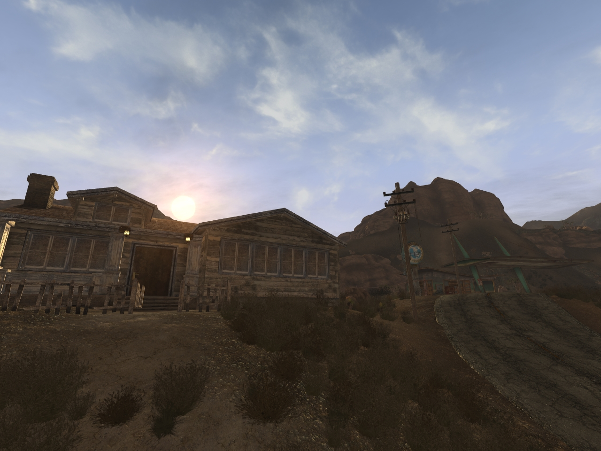

# **MAXIMUM NEW VEGAS**
☢️ [_Sigourns Original Guide_](https://github.com/Sigourn/iheartnewvegas), RIP 

Last updated: February 12th, 2023.

🚧 The current state of the fork is... **UNSTABLE-WIP-PLAYABLE**.

> A personal modlist using Sigourns *"LEFT MY HEART IN NEW VEGAS"* as a base, with some extra mods and setups I **personally** use. NOT FOR FIRST TIME PLAYERS.

## Disclaimer

If you've never played Fallout: New Vegas before, I recommend following the [**Viva New Vegas**](https://vivanewvegas.github.io/) modding guide. It has a fraction of the mods present here, and will take you considerably less time to follow and install appropriately. Also, I highly recommend you check out [**Wall_SoGB’s performance guide**](https://wallsogb.github.io/FalloutNV-Performance-Guide/) as it provides so much info regarding the nitty-gritty of optimizing your game for your hardware (and just some good tech knowledge regardless).

Feel more than welcome to post any issues and point out where exactly I can make improvements. Your feedback is greatly appreciated.

## About

**MAXIMUM New Vegas** is my modular modding guide for **Fallout: New Vegas**. It's what I *personally* use when I run my playthroughs. It's pretty deep with loads of objective (and subjective) improvements to the game regarding Quality of Life Fixes, Bug Squashing and ALOT more Vanilla+ flavoured content.

What this guide **doesn't** do:

- Address every single micro-issue in the game: no game is perfect and all of them have flaws, yet we still enjoy them. My intention is to fix or at least address the most glaring ones.
- Do your dishes.
- A̷̡̧̺͚̜̹͌͐͗̇̾͗̒͗͘͜͠͝ş̸̡͍̣̙̙̝̜̬̃ç̶̡̢̟̩̳̱͙͈̺̭̱̱̱͚̜̒̈́̽̓̏è̵̛̙̽̾͋̈̊̐̿̌̍̽̊n̸̡̧̩̻̫̤͙̳̥̹̗͈̥̲͈̩̾̾̔͑͗̅̍̓̂̅͛͠͝d̴͉̮̤͓̤̈́́̅͐̓̉̒̉̅̽̀͘̕̚ͅ ̶̡̤̙̼͎̭͚̭̣̞͌̆͛̍͒̄̌̀͑͜R̶̺̼̲̤̗͉̞̭̂́̌̆̓̿́͌̉̏͂̊̍͛̚ë̴̡̧̫̜͎̣̟̯͌̇̑̈̏̓͊͜a̸̡̫̝̦̦͕̽̎͊̾̚ͅl̶̨̡̝̦̜͍̪̱̼̜̝̳̄͋̈̐̈́̍̈̅͌̿̾͜͜͠͠͠͝ī̷͔͙̗̳̫͔̺̬̙̖̋̌̔̑̌͐̓ṭ̵̢̙̗̣͕̤̝̼͉̅̈́͊̃̓̿y̸̡̘̫̫̙̭̹̦̆̀͆̔̉ͅͅ.̶̢̨̛̫̯̝͇̰̦̰̥̙͍̹̒̇̒̀̈́̈́͐̐̈́̃̉̈́̅☻

 
 

Sigourn: _"I've worked on this modlist for a few years already, but only recently decided to make a guide out of it. All I ask in return is your patience when it comes to following instructions. If I took the time to write them, you *should* take the time to read them."_

## My setup

After installing everything, my framerate averages around 50 - 75fps. For reference, here's my setup as well:

System | My Specs
------------ | -------------
OS  | Windows 10 64-bit
CPU | Intel Core i7-4790 (Initially an i3-4150)
RAM | 16GB DDR3 1333Hz
GPU | 2GB NVIDIA T400
HDD | 1TB WD Blue 3.5" (Including an NVMe drive for my OS only)
DP  | Dell S2721HN @ 1080P 75Hz

> Both my CPU and GPU are at 50% load majority of the time, and RAM at about 4-6 GB. Really not a hard game to run honestly.

## Frequently asked questions

### How many plugins are there?

There are about **120** plugins total.

### How much space do I need to install these mods?

Roughly 7.5GB.

### Is this guide compatible with...?

No clue to be honest with you.

---

[_**SETUP >>**_](SETUP.md)
